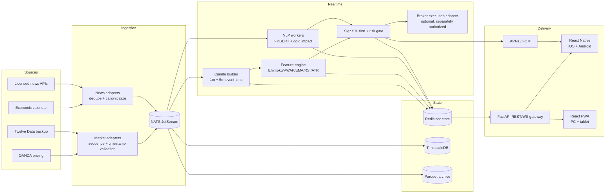
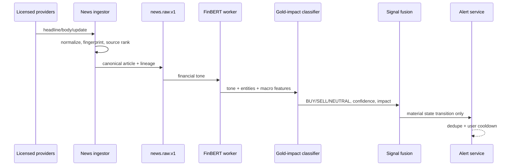

# Aurum Edge — production architecture

> **Scope:** decision-support and paper-trading architecture for XAU/USD on closed 1-minute and 5-minute bars. A mobile phone is not an HFT execution venue. Market ingestion, signal calculation, risk gates, and broker order state must remain server-side. No strategy is profitable by specification; tune only through out-of-sample testing and include spread, commission, financing, rejection, and slippage.

## 1. Architecture and stack decision

### Recommended stack

| Layer | Choice | Why |
|---|---|---|
| iOS / Android | **React Native + Expo (TypeScript)** | Shared domain/UI code, mature WebView, push notifications, OTA delivery, and excellent web reuse. |
| PC / browser | **React + Vite PWA** (implemented here) | Fast desktop terminal, installable, keyboard/mouse interaction, responsive mobile fallback. |
| Chart | **TradingView Lightweight Charts** inside WebView/browser | Hardware-accelerated canvas, compact payload, streaming updates. Commercial TradingView Charting Library is needed for a full built-in drawing-tool suite and requires a separate license. |
| Edge/API | **Python 3.12 + FastAPI + Uvicorn** | Async WebSockets plus direct access to NumPy/FinBERT/backtest tools. Keep CPU/GPU model work off the API event loop. |
| Event backbone | **NATS JetStream** (or Redpanda/Kafka at larger scale) | Durable subjects, replay, low operational latency, consumer isolation. |
| Hot state | **Redis Cluster** | Latest quote, bar, signal, idempotency keys, distributed locks, rate limits. |
| Time series | **TimescaleDB/PostgreSQL** | OHLCV, signals, news lineage, trades; SQL and time-bucket retention. |
| Raw archive | S3-compatible object storage + Parquet | Immutable tick/news replay and model audits. |
| NLP workers | Python, FinBERT on a GPU pool; OpenAI as instrument-aware second stage | FinBERT measures financial text tone; the second stage maps macro tone to *gold price impact*. |
| Observability | OpenTelemetry, Prometheus, Grafana, Loki, Sentry | End-to-end latency, data gaps, model drift, client faults. |

**Why not a Node-only backend?** Node is excellent for socket fan-out, but Python avoids a second language around FinBERT, feature generation, research, and backtesting. FastAPI handles this 1m/5m workload comfortably. If fan-out reaches tens of thousands of concurrent sockets, split a stateless Go/Node gateway from Python strategy workers; do not rewrite the NLP layer.

### Logical architecture



### Service boundaries

1. **market-ingestor** — one active adapter per account/provider; normalizes bid/ask ticks into a versioned schema. Provider timestamps are retained alongside receive timestamps.
2. **bar-builder** — event-time 1m/5m windows. Publishes provisional updates and exactly one immutable `candle.closed.v1` event. Late-tick policy is explicit.
3. **feature-worker** — computes indicators only from closed bars. A feature record stores settings and source candle IDs to prevent look-ahead leakage.
4. **news-ingestor** — licensed APIs/RSS only. Never scrape Reuters, Bloomberg, or other restricted pages. Deduplicates syndicated headlines and tracks corrections.
5. **sentiment-worker** — produces direction, confidence, impact, horizon, model version, prompt version, and source lineage.
6. **strategy-worker** — deterministic fusion and risk gates. It emits recommendations, never silent broker orders.
7. **execution service** — optional isolated service with separate credentials, idempotent client order IDs, pre-trade limits, reconciliation, and a global kill switch.
8. **gateway** — REST bootstrap and resumable WebSocket delivery. No model inference in request handlers.

## 2. Market data provider selection

| Provider | Recommended role | Notes |
|---|---|---|
| **OANDA v20** | Primary when OANDA is also the broker | Executable account-specific bid/ask and coherent order integration. Gold availability/symbol and account eligibility vary by region. The pricing stream is throttled but more than adequate for closed 1m bars. |
| **Twelve Data** | Fastest prototype and independent backup | Simple metals WebSocket/REST. Confirm websocket entitlement, redistribution rights, tick-volume semantics, and request limits for the selected plan. Starter adapter is implemented in `market_feed.py`. |
| **Polygon** | COMEX gold futures reference | Strong exchange-oriented feed, but COMEX GC futures are not OTC XAU/USD. Do not merge them without contract rollover and futures/spot basis handling. |
| **Finnhub / FMP** | News, macro calendar, secondary reference | Useful news/economic connectors; not the preferred executable XAU/USD quote. |
| **Bloomberg / Reuters** | Enterprise news | Use licensed feeds/contracts only; no HTML scraping. |

**Production recommendation:** use the broker's bid/ask as the strategy and execution truth, plus a separately licensed reference provider for stale/divergent-feed detection. Never switch prices mid-position without recording a feed-regime event.

### Data quality gates

- Mark feed **stale** when no tick is received for 2 seconds in an active session (provider-specific threshold); do not open positions.
- Quarantine a tick with a negative spread, timestamp regression beyond 2 seconds, impossible price, or a jump above 8 rolling ATR without a corroborating provider.
- Pause when primary/reference mid prices differ by `max(0.30 × ATR14, 3 × median spread)` for 3 samples.
- Store UTC only, use monotonic receive clocks for latency, and resolve daylight-saving time only at the session/calendar presentation layer.
- The OTC feed's `volume` is normally **tick volume**, not centralized traded volume. Label it accurately. Use COMEX volume only as a separate feature.

## 3. Event and API contracts

Core WebSocket events are versioned even if the public JSON envelope remains compact:

```json
{
  "type": "market.update",
  "sequence": 1942291,
  "serverTime": "2026-08-14T14:32:08.123Z",
  "tick": { "symbol": "XAU/USD", "bid": 3358.33, "ask": 3358.51, "provider": "oanda" },
  "candles": {
    "1m": { "timestamp": "2026-08-14T14:32:00Z", "open": 3358.21, "high": 3358.63, "low": 3358.12, "close": 3358.42, "complete": false },
    "5m": { "timestamp": "2026-08-14T14:30:00Z", "open": 3356.80, "high": 3358.63, "low": 3356.61, "close": 3358.42, "complete": false }
  }
}
```

Clients bootstrap with REST, then subscribe using the returned sequence. A production gateway retains a short replay buffer; on a sequence gap the client re-fetches bars before applying more deltas.

Implemented endpoints:

- `GET /api/v1/health`
- `GET /api/v1/market/{1m|5m}/candles?limit=300`
- `POST /api/v1/news/analyze`
- `POST /api/v1/strategy/evaluate`
- `WS /ws/v1/market/xauusd`

## 4. News and sentiment pipeline



### Classification contract

- `BUY`: information is expected to support XAU/USD over the next 5–30 minutes.
- `SELL`: information is expected to pressure XAU/USD over that horizon.
- `NEUTRAL`: ambiguous, balanced, stale, already priced, or no direct causal channel.
- Confidence is calibrated probability-like output, not model softmax displayed raw. Calibrate on a held-out, time-ordered gold-news dataset using isotonic regression.
- Impact considers event class, source authority, novelty, surprise versus consensus, session liquidity, and realized 30-second volatility—not sensational wording.

A key distinction: “inflation rose” can be bearish gold if it pushes real yields/USD up, or bullish if it causes de-anchoring/stagflation concern. FinBERT alone cannot make that instrument-specific inference. Use deterministic macro features plus a constrained LLM JSON stage. Send only licensed text the contract permits to third parties; otherwise run the local model.

### Alert policy

Push only when all are true: impact is high, confidence ≥ 75, the result is newer than 90 seconds, and the fused state changed (`BUY→SELL`, `NEUTRAL→BUY`, etc.). Deduplicate story clusters for 15 minutes. Include source, timestamp, confidence, invalidation, and “decision support—not advice.”

## 5. Ichimoku scalp strategy specification

### Settings policy

| Timeframe | Execution setting | Confirmation setting | Rationale |
|---|---|---|---|
| 1m | **7 / 22 / 44**, displacement 22 | 5m 9 / 26 / 52 | Faster response while preserving approximately 1:2:4 structure. |
| 5m | **9 / 26 / 52** baseline | 15m trend state, optional | Standard setting is less noisy and should be the benchmark. |
| Research candidate | 9 / 30 / 60 | same | More conservative regime; deploy only if walk-forward results dominate after costs. |

Do not select settings from the same period used to report performance. Use anchored walk-forward optimization, purged time-series CV, and a minimum number of trades per volatility/session regime.

### BUY entry — evaluated only after bar close

All hard conditions:

1. Tenkan crosses above Kijun on the latest or immediately preceding closed bar and remains above.
2. Close is above the visible Kumo top by at least `0.08 × ATR14`.
3. Visible cloud is bullish: Senkou A > Senkou B.
4. Chikou validation: current close is above the high 22 periods back. This compares current price with past structure; the implementation does not use future data.
5. Close is above EMA200 and current session VWAP.
6. RSI7 is 52–72. Above 72 blocks chasing; below 52 lacks momentum.
7. 5m bias is BUY or NEUTRAL; a SELL bias subtracts enough weight to normally reject the setup.
8. Spread ≤ 2× rolling median, no event blackout, no volatility-shock gate, and feed is healthy.

SELL is symmetric: bearish cross; close below Kumo minus `0.08 ATR`; A < B; Chikou below past low; below EMA200/VWAP; RSI7 28–48.

### Fusion score

| Feature | Points |
|---|---:|
| Fresh Tenkan/Kijun cross | 20 |
| Price accepted beyond cloud | 18 |
| Senkou alignment | 10 |
| Chikou clearance | 10 |
| EMA200 alignment | 15 |
| VWAP alignment | 12 |
| RSI confirmation | 10 |
| News alignment | +5 (conflict −12) |
| 5m alignment | +5 (conflict −10) |

Clamp to 0–100. Minimum actionable score is **72**. A high-impact opposing news result at ≥75%, event blackout, spread >2× baseline, or ATR shock is a hard `NO_TRADE` regardless of score. Weights are transparent starting priors, not claims of predictive value; version and calibrate them.

### Stop, target, expiry, and exit

For BUY:

```text
structure_stop = min(low of last 6 bars) - 0.15 × ATR14
raw_distance   = entry - structure_stop
stop_distance  = clamp(raw_distance, 0.90 × ATR14, 1.40 × ATR14)
SL             = entry - stop_distance
TP             = entry + stop_distance × (2.0 when score≥85, otherwise 1.8)
```

SELL is mirrored. Size from stop distance, not conviction: `units = floor(account_equity × risk_fraction / (stop_distance × contract_value_per_price_unit))`. Recalculate contract value from broker metadata and account currency. Default risk should be 0.25%; hard cap 0.5% per trade, 1% aggregate open risk, and 1.5% daily realized+unrealized loss.

Exit at the first of: broker-side SL, TP, closed-bar Kijun invalidation, opposite confirmed cross, or time stop (8 bars on 1m, 6 on 5m). Never widen a stop. Optionally move to break-even only after +1R and a new structure low/high—not from arbitrary elapsed time.

## 6. Economic-release and false-breakout controls

### NFP, CPI, PCE, FOMC, rate decisions

- Calendar service creates a hard blackout from **T−5 minutes to T+3 minutes** for tier-1 releases. Use T+10 for rate statements and through the press-conference opening volatility for FOMC.
- At T−5: cancel unfilled entries. At T−1: optionally reduce/close scalps according to a predeclared policy; never improvise from a headline.
- Re-enable only after spreads are below 1.5× median for 30 seconds, quote divergence clears, and two bars have formed. A timer alone is insufficient.
- Reject an execution when expected slippage is above `min(0.15 × ATR, configured USD cap)`. Use protected limit/stop-limit orders where broker semantics support them; accept that protection can cause missed fills.
- Treat partial fills, rejection, reconnect, and “order accepted but response lost” as normal states. Reconcile with broker order IDs before retrying.

### Low-liquidity / false breakout

- Model session and day-of-week. During rollover and thin late-US/early-Asia periods, require relative tick volume ≥60% of the 30-bar median and either two closes beyond Kumo or a retest that holds.
- Reject breakout bars with body/range <35%, an opposing wick >50%, or ATR <50% / >220% of the same-session rolling median.
- Add `0.08 ATR` cloud clearance and wait for closed bars; never act on a provisional cross.
- Avoid duplicate entries while the same Ichimoku cross ID is active. Require a reset (Tenkan recross or Kumo re-entry) before another signal.

## 7. Mobile/chart design

The implemented PWA renders candles and overlays with `lightweight-charts`, uses `ResizeObserver`, and updates only the active candle. For React Native, place the same chart bundle in `react-native-webview` and communicate through a narrow message bridge:

- Native → WebView: bootstrap bars, candle delta, theme, timeframe, viewport command.
- WebView → Native: crosshair, visible range, drawing persistence, readiness, errors.
- Batch at animation-frame cadence; never inject an entire HTML string per tick.
- Keep only 500–1,000 bars in the live chart and fetch history on scroll. Downsample historical tick views server-side.
- Bundle JS locally in the app. Do not depend on a CDN in production.
- Persist drawings by symbol, timeframe, adjusted time, points, style, and schema version.

The open-source Lightweight Charts package supplies the rendering primitives, not a complete TradingView drawing suite. Implement a small approved tool set (trend line, horizontal line, rectangle, Fibonacci) as custom primitives, or license TradingView's Charting Library.

## 8. Reliability, security, and compliance

### SLOs

- Market tick ingest-to-gateway p95 <150 ms, p99 <400 ms.
- Closed-bar-to-signal p95 <250 ms excluding remote LLM; news must not block the technical pipeline.
- API availability 99.9%; data completeness ≥99.99% of expected bars.
- Alert creation p95 <2 seconds after final classification.

### Controls

- Secrets in cloud KMS/Secrets Manager; never in mobile binaries, source, or logs.
- Short-lived OIDC access tokens; rotating refresh tokens in OS secure storage; WebSocket authorization and per-user topic ACLs.
- Encrypt in transit/at rest; redact article bodies and broker identifiers in telemetry.
- Signed strategy/model releases, four-eye production promotion, immutable audit events.
- Broker idempotency keys, max order size/notional, daily loss limit, stale-price checks, and a remotely testable kill switch.
- Legal review for market-data redistribution, news usage, model data transfer, regional derivatives access, push wording, and record retention.

## 9. Deployment topology and implementation plan

1. **Foundation:** schemas, provider contract tests, event-time bar builder, Timescale migrations, raw replay harness.
2. **Terminal:** completed responsive PWA shell; connect REST bootstrap/WS resume; add authenticated user preferences and local chart assets.
3. **Indicators:** golden-vector tests against an independent library; no-look-ahead tests; feature version registry.
4. **Research:** tick-accurate spread/slippage simulator, purged walk-forward tests by London/NY/Asia and volatility regime, paper shadow signals.
5. **News:** licensed connectors, cluster dedupe, FinBERT worker, constrained gold-impact stage, calibration and human review queue.
6. **Risk/paper execution:** state machine, idempotency, reconciliation, event guard, kill switch, chaos tests.
7. **Native:** Expo shell, WebView bridge, secure auth, APNs/FCM, offline/read-only state, app-store hardening.
8. **Controlled release:** 4–8 weeks shadow mode, then paper trading. Any live execution requires broker/legal approval, explicit user confirmation, and separately audited controls.

Deploy gateway replicas across two availability zones. Market adapters use leader election per provider account. Partition NATS by symbol and preserve order per symbol. Strategy workers are stateless consumers; Redis contains only reconstructible hot state. All durable decisions go to PostgreSQL and object storage.
