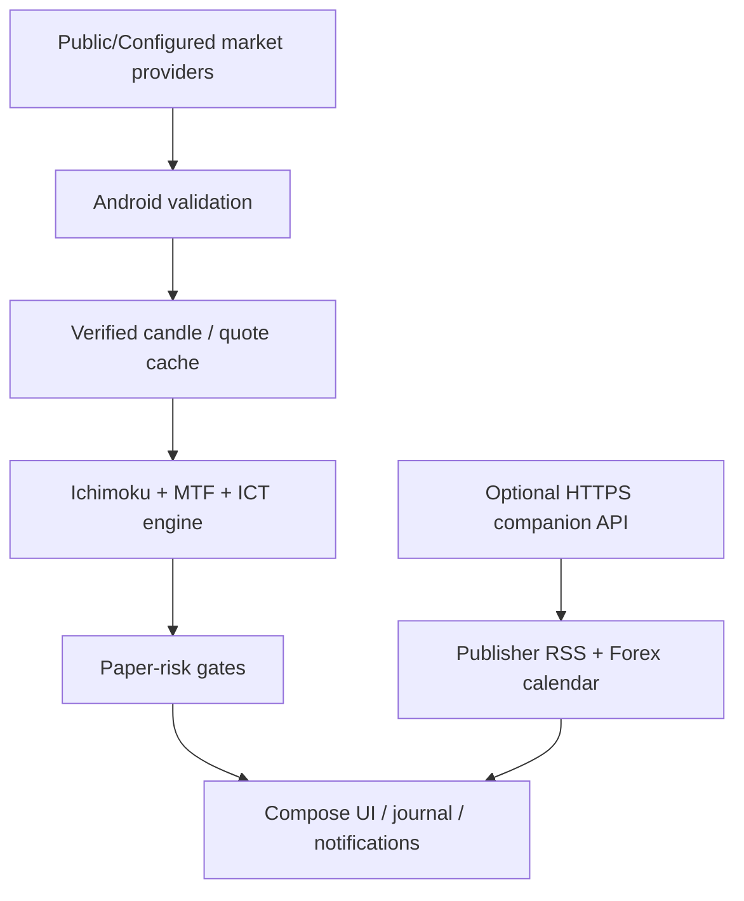

# معماری Aurum Edge — Android-first

## محدودهٔ محصول

Aurum Edge یک اپ بومی **Android** با Kotlin و Jetpack Compose است. این مخزن رابط وب یا PWA ندارد. اپ برای نمایش دادهٔ واقعی، تحلیل ایچیموکو، پژوهش، بک‌تست و معاملهٔ کاغذی XAU/USD و هفت جفت‌ارز اصلی طراحی شده است.

- سفارش واقعی، اتصال کارگزاری و نگه‌داری credential معاملاتی در اپ وجود ندارد.
- دادهٔ نبودۀ بازار، خبر یا عملکرد تولید نمی‌شود.
- وضعیت قطع/کهنه‌بودن منبع باید به‌صراحت به کاربر نمایش داده شود.
- تحلیل و بک‌تست ابزار آموزشی‌اند و تضمین سود یا توصیهٔ سرمایه‌گذاری نیستند.

## اجزای اصلی

| لایه | پیاده‌سازی | مسئولیت |
|---|---|---|
| رابط کاربر | Kotlin + Jetpack Compose | تب‌های خانه، چارت، معاملهٔ کاغذی، دیده‌بان، خبر، ژورنال، یادگیری و تنظیمات |
| موتور تحلیل | Kotlin خالص | Ichimoku، MTF، ICT/range، مدیریت ریسک، بک‌تست و گزارش‌گیری |
| دادهٔ بازار | Twelve Data، Yahoo، Swissquote و Gold-API | کندل و quote خواندنی با اعتبارسنجی نماد، زمان و OHLC |
| ذخیره‌سازی دستگاه | Atomic files / SQLite | تنظیمات، ژورنال کاغذی، تاریخچهٔ quote و دادهٔ پژوهش |
| اعلان | Android foreground service + notification channels | هشدار فرصت و ورود کاغذی با dedup و گیت‌های فنی |
| API اختیاری | FastAPI در `backend/` | گیت خبر/AI سمت سرور و منابعی که اپراتور باید روی HTTPS مستقر کند |

## جریان داده


```mermaid
flowchart TD
  P[Public/Configured market providers] --> V[Android validation]
  V --> C[Verified candle / quote cache]
  C --> E[Ichimoku + MTF + ICT engine]
  E --> R[Paper-risk gates]
  R --> U[Compose UI / journal / notifications]
  N[Publisher RSS + Forex calendar] --> U
  S[Optional HTTPS companion API] --> N
```

### قواعد اعتبار داده

1. پاسخ باید نماد و تایم‌فریم درخواستی را دقیقاً اعلام کند.
2. زمان کندل باید UTC، غیرآینده و هم‌راستا با بازه باشد.
3. OHLC، حجم، تکرار و ترتیب زمانی پیش از ورود به موتور بررسی می‌شوند.
4. quote قدیمی یا ناقص هرگز به‌عنوان قیمت زنده یا مجوز ورود استفاده نمی‌شود.
5. اگر منبع حداقل پنجرهٔ واقعی لازم را ندهد، اپ خطا/وضعیت ناکافی نشان می‌دهد؛ padding و interpolation مجاز نیستند.

## معاملهٔ کاغذی و اعلان

ورود کاغذی فقط پس از شرایط فنی، quote تازه، کنترل ریسک، MTF و گیت ICT ثبت می‌شود. ژورنال پیش از اعلان entry به‌صورت atomic نوشته می‌شود؛ شکست ذخیره‌سازی نباید معامله یا اعلان ساختگی بسازد. سرویس foreground و اعلان‌های Android ممکن است تحت محدودیت باتری، DND و مجوزهای دستگاه باشند.

## بک‌اند اختیاری

اپ برای مسیرهای عمومی داده و نمایش RSS به بک‌اند وابستگی اجباری ندارد. با این حال گیت خبر/AI سمت سرور، در صورت استفاده، باید روی یک سرویس HTTPS عمومی مستقر شود و URL آن در تنظیمات اپ ذخیره شود. سرور باید secretها را خارج از APK نگه دارد، نرخ‌محدودسازی و کنترل دسترسی مناسب داشته باشد و هرگز مسیر سفارش واقعی باز نکند.

## ساخت و آزمون

```bash
cd android
./gradlew testDebugUnitTest assembleDebug
```

JDK 17 و Android SDK 35 لازم‌اند. GitHub Actions در `.github/workflows/main.yml` همین تست‌ها و ساخت APK را اجرا می‌کند. برای خروجی release قابل نصب و به‌روزرسانی، باید از کلید امضای پایدارِ مالک که خارج از مخزن نگه‌داری می‌شود استفاده شود.

برای جزییات منبع داده، هشدار، replay و تب‌های اپ به این راهنماها رجوع کنید:

- [راهنمای اندروید](ANDROID.md)
- [تب‌ها و قابلیت‌ها](ANDROID_TABS.md)
- [هشدارها](ALERTS_FA.md)
- [نقشهٔ راه](ROADMAP_FA.md)
